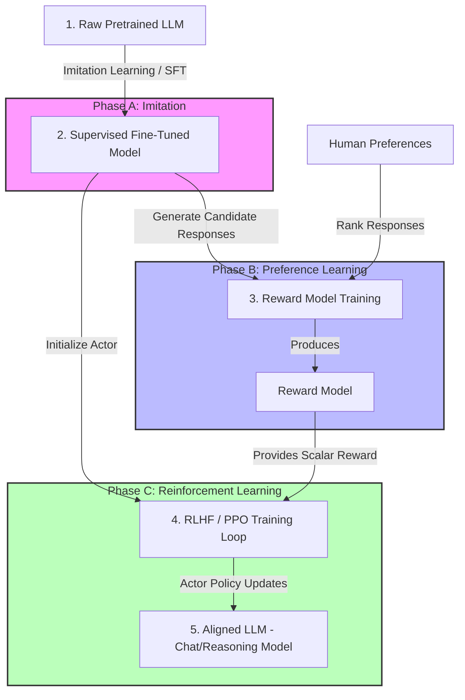

# 🍳 RIL Cookbook: Reinforcement & Imitation Learning Recipes

Welcome to the **RIL Cookbook** (Reinforcement and Imitation Learning Cookbook). This repository is a structured curriculum of core reinforcement learning algorithms and imitation learning paradigms. It is designed to demonstrate deep understanding of decision-making systems and directly bridges the gap between classic control algorithms and **modern Generative AI (GenAI) alignment techniques** (such as SFT, RLHF, PPO, and DPO).

---

## 🗺️ Curriculum Map & GenAI Parallels

Each module is structured to start with fundamental theory, progress to environment implementation, and conclude with how these exact mathematical frameworks underpin modern Large Language Model (LLM) training.

| Module | Core RL Concept | Key Environments | Primary Algorithms | GenAI / LLM Parallel |
| :--- | :--- | :--- | :--- | :--- |
| [**01: Imitation Learning**](file:///d:/Reading_Resources/Master/RIL/lab/01_imitation_learning/README.md) | Behavioral Cloning (BC), Supervised Policy Learning | Simple Target Pursuit | Supervised Regression | **SFT (Supervised Fine-Tuning)**: Mimicking human dialogue demonstrations |
| [**02: Q-Learning**](file:///d:/Reading_Resources/Master/RIL/lab/02_q_learning/README.md) | Value-Based RL, TD Learning, State Discretization | Grid Delivery, MountainCar | Tabular Q-Learning | **Reasoning & Search**: MCTS/Q* planning, search-based reasoning (e.g., o1/Strawberry) |
| [**03: Policy Gradients**](file:///d:/Reading_Resources/Master/RIL/lab/03_policy_gradients/README.md) | Policy-Based RL, Policy Gradient Theorem | MountainCar | REINFORCE | **RLHF (RL from Human Feedback)**: Parameter update via reward modeling |
| [**04: Actor-Critic**](file:///d:/Reading_Resources/Master/RIL/lab/04_actor_critic/README.md) | Actor-Critic Architectures, Variance Reduction | MountainCar | A2C (Advantage Actor-Critic) | **PPO Alignment (Proximal Policy Optimization)**: Actor (LLM) and Critic (Value Net) |
| [**05: Comprehensive Study**](file:///d:/Reading_Resources/Master/RIL/lab/05_comprehensive_mountaincar/README.md) | Algorithm Comparison & Benchmark | MountainCar | BC, Q-Learning, REINFORCE, A2C | **Model Alignment Selection**: Choosing the right alignment framework |

---

## 🚀 The GenAI Alignment Pipeline

Modern generative model alignment is a direct extension of reinforcement and imitation learning. The diagram below illustrates how the concepts in this cookbook assemble into the standard LLM alignment workflow (SFT $\rightarrow$ Reward Model $\rightarrow$ PPO / RLHF):



---

## 📂 Repository Directory Layout

- [**`01_imitation_learning/`**](file:///d:/Reading_Resources/Master/RIL/lab/01_imitation_learning/)
  - [`behavioral_cloning_basics.ipynb`](file:///d:/Reading_Resources/Master/RIL/lab/01_imitation_learning/behavioral_cloning_basics.ipynb): Simple 1D behavioral cloning matching expert heuristics.
  - [`behavioral_cloning_reflection.md`](file:///d:/Reading_Resources/Master/RIL/lab/01_imitation_learning/behavioral_cloning_reflection.md): In-depth review of imitation learning constraints (distribution shift).
- [**`02_q_learning/`**](file:///d:/Reading_Resources/Master/RIL/lab/02_q_learning/)
  - [`q_learning_delivery_rider.ipynb`](file:///d:/Reading_Resources/Master/RIL/lab/02_q_learning/q_learning_delivery_rider.ipynb): Implementing Q-table updates in a custom grid-world delivery task.
  - [`q_learning_mountaincar.ipynb`](file:///d:/Reading_Resources/Master/RIL/lab/02_q_learning/q_learning_mountaincar.ipynb): Discretizing continuous state space to solve MountainCar-v0.
- [**`03_policy_gradients/`**](file:///d:/Reading_Resources/Master/RIL/lab/03_policy_gradients/)
  - [`reinforce_mountaincar.ipynb`](file:///d:/Reading_Resources/Master/RIL/lab/03_policy_gradients/reinforce_mountaincar.ipynb): Training a policy network directly using the REINFORCE algorithm and custom reward shaping.
- [**`04_actor_critic/`**](file:///d:/Reading_Resources/Master/RIL/lab/04_actor_critic/)
  - [`a2c_mountaincar.ipynb`](file:///d:/Reading_Resources/Master/RIL/lab/04_actor_critic/a2c_mountaincar.ipynb): Reducing variance in policy updates using a value function baseline (Critic) via Advantage Actor-Critic.
- [**`05_comprehensive_mountaincar/`**](file:///d:/Reading_Resources/Master/RIL/lab/05_comprehensive_mountaincar/)
  - [`mountaincar_master_comparison.ipynb`](file:///d:/Reading_Resources/Master/RIL/lab/05_comprehensive_mountaincar/mountaincar_master_comparison.ipynb): Comparative notebook containing parallel implementations of all four paradigms on MountainCar-v0.
- **`models/`**: Serialized model checkpoints (`.pth` weights and `.npy` Q-tables) demonstrating fully trained agents.
- **`assets/`**: Graphic resources, including [`mountaincar_demo.mp4`](file:///d:/Reading_Resources/Master/RIL/lab/assets/mountaincar_demo.mp4) showing successful run trajectories.

---

## 🛠️ Getting Started

### Prerequisites

You need Python 3.10+ and a virtual environment. Install the required dependencies:

```bash
# Create and activate virtual environment
python -m venv .venv
.venv\Scripts\activate

# Install requirements
pip install gymnasium numpy torch matplotlib ipykernel
```

---

## 🎓 Recruiter Takeaways

By exploring this cookbook, you will find:
1. **Clear Mathematical Translation**: Practical python implementations of the Bellman equation, policy gradients, and advantage estimations.
2. **Framework Fluency**: Experience with deep learning frameworks (PyTorch), environment frameworks (Gymnasium), and tabular configurations.
3. **GenAI Engineering Readiness**: Direct theoretical extension to modern LLM alignment paradigms, demonstrating that the candidate doesn't just call APIs, but understands the core optimization mechanics under the hood.
